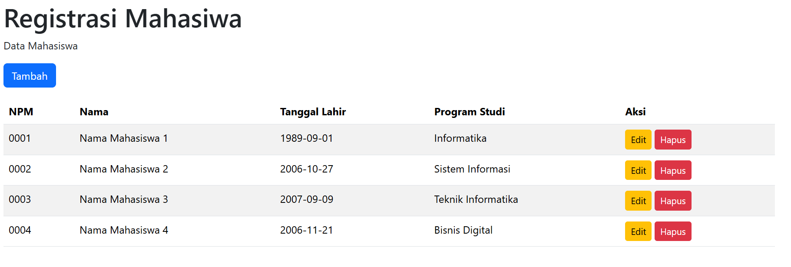

# StudentReg — Platform Registrasi Mahasiswa Digital

> **Kelola data mahasiswa dengan cepat, praktis, dan modern dalam satu sistem berbasis web.**

StudentReg adalah aplikasi web registrasi mahasiswa yang dibangun menggunakan **HTML**, **Bootstrap**, dan **jQuery**. Sistem ini dirancang untuk membantu proses pengelolaan data mahasiswa melalui fitur CRUD yang sederhana namun efisien, dengan tampilan responsif dan antarmuka yang mudah digunakan.

---

## Fitur Utama

### Manajemen Data Mahasiswa
- **Tambah Data Mahasiswa** — Menambahkan informasi mahasiswa baru melalui form registrasi interaktif.
- **Tampilkan Data** — Menampilkan seluruh data mahasiswa dalam bentuk tabel yang rapi dan responsif.
- **Edit Data** — Memperbarui informasi mahasiswa dengan mudah tanpa perlu menghapus data sebelumnya.
- **Hapus Data** — Menghapus data mahasiswa secara cepat melalui sistem delete.

### Antarmuka Modern
- **Responsive Design** — Tampilan website menyesuaikan berbagai ukuran layar mulai dari desktop hingga smartphone.
- **Bootstrap Framework** — Menggunakan komponen modern Bootstrap untuk desain yang bersih dan profesional.
- **Interaksi Dinamis** — jQuery digunakan untuk meningkatkan pengalaman pengguna dengan manipulasi data secara real-time.

### Pengelolaan Data yang Praktis
- **Validasi Form Input** — Membantu memastikan data yang dimasukkan sesuai format.
- **Navigasi Sederhana** — Tata letak dirancang agar mudah dipahami bahkan untuk pengguna baru.
- **Tabel Data Interaktif** — Memudahkan pengguna melihat dan mengelola data mahasiswa secara efisien.

---

## Teknologi yang Digunakan

| Teknologi | Fungsi |
|------------|---------|
| **HTML5** | Struktur utama halaman web |
| **Bootstrap 5** | Framework CSS untuk desain responsive |
| **jQuery** | Manipulasi DOM dan interaksi dinamis |
| **JavaScript** | Logika aplikasi dan fitur CRUD |

---

## Filosofi Desain

StudentReg mengusung konsep **Simple Academic Interface** yang berfokus pada:

1. **Kemudahan Penggunaan**  
   Antarmuka dibuat sederhana agar pengguna dapat langsung memahami fungsi sistem tanpa proses belajar yang rumit.

2. **Efisiensi Pengelolaan Data**  
   Semua fitur CRUD dirancang agar proses penginputan dan pengelolaan data mahasiswa menjadi lebih cepat.

3. **Tampilan Modern dan Responsif**  
   Menggunakan Bootstrap untuk memastikan tampilan tetap nyaman di berbagai perangkat.

---

## Struktur Fitur CRUD

### Create
Menambahkan data mahasiswa baru ke dalam sistem.

### Read
Menampilkan daftar seluruh mahasiswa yang telah terdaftar.

### Update
Mengedit atau memperbarui data mahasiswa yang sudah ada.

### Delete
Menghapus data mahasiswa dari sistem.

---

## Screenshot Aplikasi

> 

---

## Struktur Project

```bash
STUDENT-REGISTRATION/
│
├── Assets/
│   └── TampilanWeb.png
│
├── .gitattributes
├── index.html
└── README.md
```

---

## Cara Menjalankan Project

1. Clone repository ini

```bash
git clone https://github.com/ReaReiKulo/Student-Registration.git
```

2. Masuk ke folder project

```bash
cd studentreg
```

3. Jalankan file `index.html` di browser

---

## Tim Pengembang

Aplikasi ini dikembangkan sebagai media pembelajaran dan implementasi CRUD berbasis web.

| Nama Anggota | Peran & Tugas |
|--------------|---------------|
| **Daud** | Frontend Developer |
| **Tim Project** | UI Design & Documentation |

---

## Informasi Proyek

Project ini dibuat untuk mempelajari implementasi CRUD menggunakan teknologi frontend modern seperti HTML, Bootstrap, dan jQuery.

© 2026 StudentReg Project Team
